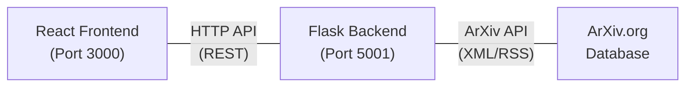

# AnveXan - ArXiv Paper Search & Download

A modern web application for searching and downloading research papers from ArXiv with advanced directory selection capabilities.

## 🌟 Features

- 🔍 **Smart Search**: Search across all ArXiv papers using keywords
- 📖 **Paper Preview**: View abstracts and summaries before downloading
- 📁 **Directory Selection**: Choose specific download directories with File System Access API
- 📥 **Dialog-Free Downloads**: Download papers directly to selected folders without browser dialogs
- 🔄 **Multiple Download Methods**: Automatic fallbacks ensure downloads always work
- 🌐 **Modern UI**: Clean, responsive React interface
- 🐳 **Docker Support**: Easy deployment with Docker containers

## 🏗️ Architecture

The application consists of two main components:

- **Frontend**: React application running on port 3000
- **Backend**: Flask REST API server running on port 5001



## 🚀 Quick Start

### Option 1: Development Mode (Recommended)

1. **Clone the repository:**
   ```bash
   git clone <repository-url>
   cd anvexan
   ```

2. **Run the development servers:**
   ```bash
   chmod +x run-react-dev.sh
   ./run-react-dev.sh
   ```

3. **Access the application:**
   - Frontend: `http://localhost:3000`
   - Backend API: `http://localhost:5001`

The script will automatically:
- Set up Python virtual environment
- Install backend dependencies
- Install frontend dependencies
- Start both servers with hot reload

### Option 2: Docker Deployment

1. **Build and run with Docker Compose:**
   ```bash
   docker-compose up --build
   ```

2. **Access the application:**
   - Application: `http://localhost:3000`
   - API: `http://localhost:5001`

## 📂 Project Structure

```
anvexan/
├── backend/
│   ├── arxiv_paper_getter.py    # Flask API server
│   ├── requirements.txt         # Python dependencies
│   └── Dockerfile.backend       # Backend container config
├── frontend/                    # React application
│   ├── src/
│   │   ├── components/          # React components
│   │   ├── App.js              # Main application
│   │   └── index.js            # Entry point
│   ├── public/                 # Static assets
│   ├── package.json            # Node.js dependencies
│   └── Dockerfile.frontend-react
├── docker-compose.yml          # Container orchestration
├── run-react-dev.sh           # Development server script
└── README.md                  # This file
```

## 🎯 How to Use

### 1. Search for Papers
- Enter keywords in the search box (e.g., "machine learning", "quantum computing")
- Use the suggested tags for common searches
- Browse through the results with paper abstracts

### 2. Set Up Directory Downloads (Optional)
- Click the settings gear icon (⚙️)
- Click "Choose Directory" to select where PDFs should be saved
- Grant permission when prompted by your browser
- Files will now save directly to your chosen folder without dialogs

### 3. Download Papers
- Click "Download PDF" on any paper
- Choose from multiple download options:
  - **To Selected Directory**: Direct save to your chosen folder (no dialogs)
  - **Browser Download**: Standard browser download
  - **Direct Link**: Open PDF URL directly
  - **View PDF**: Preview in browser before downloading

## 🔧 Development

### Backend Development
```bash
# Activate virtual environment
source venv/bin/activate

# Install dependencies
pip install -r requirements.txt

# Run backend server
python arxiv_paper_getter.py
```

### Frontend Development
```bash
# Navigate to frontend
cd frontend

# Install dependencies
npm install

# Start development server
npm start

# Run tests
npm test
```

### API Endpoints

#### GET /search
Search for papers on ArXiv.

**Parameters:**
- `query` (required): Search query string

**Response:**
```json
[
  {
    "title": "Paper Title",
    "summary": "Abstract/summary text",
    "link": "https://arxiv.org/abs/1234.5678",
    "pdf_link": "https://arxiv.org/pdf/1234.5678.pdf",
    "clean_title": "cleaned-filename-safe-title"
  }
]
```

## 🌐 Browser Compatibility

### File System Access API Support:
- ✅ Chrome 86+ (full support)
- ✅ Edge 86+ (full support)
- ⚠️ Firefox (fallback to standard downloads)
- ⚠️ Safari (fallback to standard downloads)

The application automatically detects browser capabilities and provides appropriate download methods.

## 🐳 Docker Configuration

### Backend Container
- **Base**: Python 3.9 slim
- **Port**: 5001
- **Health Check**: HTTP endpoint monitoring

### Frontend Container
- **Base**: Node.js 18 Alpine
- **Port**: 3000
- **Build**: Optimized production build
- **Serving**: Nginx for static files

## 🔧 Configuration

### Environment Variables
- `REACT_APP_API_BASE_URL`: Backend API URL (for Docker)
- `FLASK_ENV`: Flask environment (development/production)

### Browser Settings for Best Experience
To eliminate download dialogs completely:

**Chrome/Edge:**
1. Go to Settings → Downloads
2. Turn off "Ask where to save each file before downloading"

## 🧪 Testing

The application includes comprehensive test coverage:

```bash
# Frontend tests
cd frontend
npm test

# Run all tests with coverage
npm test -- --coverage --watchAll=false
```

## 🤝 Contributing

1. Fork the repository
2. Create a feature branch: `git checkout -b feature/your-feature-name`
3. Make your changes
4. Run tests: `npm test` (frontend) 
5. Commit changes: `git commit -m "Add: description of changes"`
6. Push to branch: `git push origin feature/your-feature-name`
7. Create a Pull Request

### Development Guidelines
- Follow PEP 8 for Python code
- Use ESLint/Prettier for JavaScript formatting
- Write tests for new features
- Update documentation as needed

## 📄 License

This project is licensed under the MIT License - see the [LICENSE](LICENSE) file for details.

## 🙏 Acknowledgments

- ArXiv.org for providing the research paper API
- React and Flask communities for excellent documentation
- File System Access API for enabling direct directory downloads

---

**Happy paper hunting! 📚🔍**

