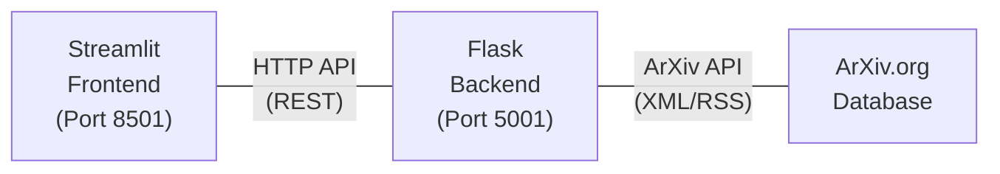

# ArXiv Paper Getter

A powerful and user-friendly application for searching and downloading research papers from ArXiv. This application provides a clean web interface for discovering academic papers and downloading them directly to your local machine.

## Features

- 🔍 **Advanced Search**: Search across all ArXiv papers using keywords
- 📖 **Paper Preview**: View abstracts and summaries before downloading
- 📥 **Direct Downloads**: Download papers as PDFs with clean filenames
- 📁 **Custom Download Paths**: Set custom download directories
- 🌐 **Web Interface**: Clean, responsive Streamlit frontend
- 🔗 **Direct Links**: Quick access to ArXiv paper pages and PDFs
- 🐳 **Docker Support**: Easy deployment with Docker containers

## Architecture

The application consists of two main components:

- **Backend**: Flask REST API server (Python) running on port 5001
- **Frontend**: Streamlit web application running on port 8501



## Installation & Setup

### Option 1: Docker Deployment (Recommended)

#### Prerequisites
- Docker and Docker Desktop installed
- Git (to clone the repository)

#### Quick Start
1. Clone the repository:
   ```bash
   git clone <repository-url>
   cd arxiv_paper_getter
   ```

2. Run the application:
   ```bash
   chmod +x run_app.sh
   ./run_app.sh
   ```

3. Access the application at `http://localhost:8501`

The script will automatically:
- Build backend and frontend Docker images
- Start both containers
- Set up network communication between them

### Option 2: Local Development Setup

#### Prerequisites
- Python 3.9 or higher
- pip package manager

#### Setup Steps
1. Clone the repository:
   ```bash
   git clone <repository-url>
   cd arxiv_paper_getter
   ```

2. Create and activate a virtual environment:
   ```bash
   python3 -m venv venv
   source venv/bin/activate  # On Windows: venv\Scripts\activate
   ```

3. Install dependencies:
   ```bash
   pip install -r requirements.txt
   ```

4. Run the application:
   ```bash
   chmod +x run_local.sh
   ./run_local.sh
   ```

Alternatively, you can run the services manually:
```bash
# Terminal 1 - Backend
python arxiv_paper_getter.py

# Terminal 2 - Frontend  
streamlit run streamlit_app.py --server.port=8501 --server.address=0.0.0.0
```

## Usage

### Basic Search
1. Open your browser and navigate to `http://localhost:8501`
2. Enter search terms in the search box (e.g., "machine learning", "quantum computing")
3. Click "Search" to find relevant papers
4. Browse through the results and expand papers to read abstracts

### Download Papers
1. **Custom Download Folder** (Optional):
   - Set a custom download path in the sidebar
   - Click "Create Folder" if the folder doesn't exist
   
2. **Download Options**:
   - **Read on ArXiv**: View the paper on ArXiv website
   - **Direct PDF**: Open PDF directly in browser
   - **Download PDF**: Download to your specified folder or browser default

### Search Tips
- Use specific keywords for better results
- Try different combinations of terms
- Use quotes for exact phrases
- Examples:
  - `"natural language processing"`
  - `machine learning classification`
  - `quantum computing algorithms`

## Development

### Project Structure
```
arxiv_paper_getter/
├── arxiv_paper_getter.py    # Flask backend API
├── streamlit_app.py         # Streamlit frontend
├── requirements.txt         # Python dependencies
├── Dockerfile.backend       # Backend container configuration
├── Dockerfile.frontend      # Frontend container configuration
├── run_app.sh              # Docker deployment script
├── run_local.sh            # Local development script
├── README.md               # This file
└── venv/                   # Virtual environment (local setup)
```

### API Endpoints

#### GET /search
Search for papers on ArXiv.

**Parameters:**
- `query` (required): Search query string

**Response:**
```json
[
  {
    "title": "Paper Title",
    "summary": "Abstract/summary text",
    "link": "https://arxiv.org/abs/1234.5678",
    "pdf_link": "https://arxiv.org/pdf/1234.5678.pdf",
    "clean_title": "cleaned-filename-safe-title"
  }
]
```

#### GET /download
Download a paper PDF.

**Parameters:**
- `pdf_link` (required): Direct PDF URL
- `title` (optional): Paper title for filename

**Response:** PDF file stream

### Technologies Used
- **Backend**: Flask, Requests, XML parsing
- **Frontend**: Streamlit, Requests
- **Deployment**: Docker, Docker Compose
- **External API**: ArXiv API

### Dependencies
```
Flask==2.3.3        # Web framework for backend API
streamlit==1.28.1   # Frontend web application framework
requests==2.31.0    # HTTP library for API calls
```

## Contributing

We welcome contributions! Here's how to get started:

### Setting up Development Environment
1. Fork the repository
2. Clone your fork:
   ```bash
   git clone https://github.com/yourusername/arxiv_paper_getter.git
   cd arxiv_paper_getter
   ```
3. Create a virtual environment and install dependencies:
   ```bash
   python3 -m venv venv
   source venv/bin/activate
   pip install -r requirements.txt
   ```

### Making Changes
1. Create a new branch for your feature:
   ```bash
   git checkout -b feature/your-feature-name
   ```
2. Make your changes
3. Test your changes:
   ```bash
   # Test backend
   python arxiv_paper_getter.py
   
   # Test frontend
   streamlit run streamlit_app.py
   ```
4. Test with Docker:
   ```bash
   ./run_app.sh
   ```

### Coding Standards
- Follow PEP 8 for Python code
- Use type hints where appropriate
- Write descriptive commit messages
- Include docstrings for functions and classes
- Test your changes thoroughly

### Submitting Changes
1. Commit your changes:
   ```bash
   git add .
   git commit -m "Add: description of your changes"
   ```
2. Push to your fork:
   ```bash
   git push origin feature/your-feature-name
   ```
3. Create a Pull Request with:
   - Clear description of changes
   - Screenshots if UI changes
   - Test results

### Areas for Contribution
- 🐛 Bug fixes
- ✨ New features (e.g., filters, sorting, bookmarks)
- 📝 Documentation improvements
- 🎨 UI/UX enhancements
- 🔧 Performance optimizations
- 🧪 Test coverage improvements

## Troubleshooting

### Common Issues

**Port Already in Use:**
```bash
# Stop existing containers
docker stop backend frontend
docker rm backend frontend

# Or kill local processes
pkill -f "python arxiv_paper_getter.py"
pkill -f "streamlit run"
```

**Docker Build Failures:**
```bash
# Clean Docker cache
docker system prune -f
docker build --no-cache -t arxiv-backend -f Dockerfile.backend .
```

**Network Issues:**
- Ensure Docker containers can communicate
- Check firewall settings
- Verify port availability (5001, 8501)

**Virtual Environment Issues:**
```bash
# Recreate virtual environment
rm -rf venv
python3 -m venv venv
source venv/bin/activate
pip install -r requirements.txt
```

## License

This project is licensed under the MIT License - see the [LICENSE](LICENSE) file for details.

## Support

For questions, bug reports, or feature requests:
- Open an issue on GitHub
- Check existing documentation
- Review troubleshooting section

---

**Happy paper hunting! 📚🔍**

